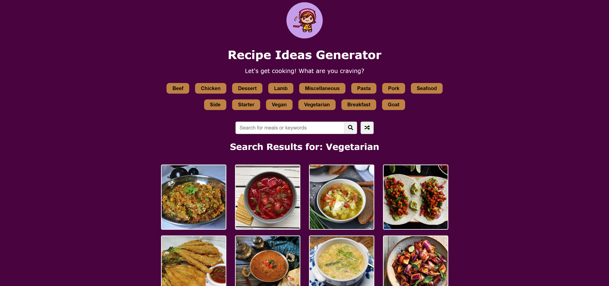

# Recipe Ideas Generator - Meal DB API



## Welcome! 👋

Thanks for checking out my mini-project!

This project was expanded from Traversy Media's 20 Vanilla Web Projects Course and utilizes the Meal DB API. (https://www.themealdb.com/api.php)

**To complete this challenge, I used HTML, CSS, and JavaScript. The meal data utilitzed is courtesy of the free Meal DB API.**

## Table of contents

- [Overview](#overview)
  - [The goal](#the-goal)
  - [Links](#links)
- [My process](#my-process)
  - [Built with](#built-with)
  - [What I learned](#what-i-learned)
- [Author](#author)

## Overview

## The goal

The goal for this mini-project was to build out a form validation component with multiple input fields and custom functions for each. The project should also be visually appealing.

Your users should be able to:

- View the optimal layout for the component depending on their device's screen size
- See hover states for all interactive elements on the page
- See specific error messages when an input is invalid

## Links

Live Site URL: [https://juliawalton.github.io/form-validator/](https://juliawalton.github.io/form-validator/)

### Built with

- Semantic HTML5 markup
- CSS3
- CSS Grid
- JavaScript
- Fetch API
- Free Meal DB API

## What I learned

This project was great to practice fetching data from an API. It's important to familiarize oneself with the documentation of a given API to understand how it can be utilized. After reviewing the documentation I played around with ways I could add more functinality to the application, like fetching and displaying the categories for meals.

```js
// get a collection of meals by category and display them
categoryBtns.addEventListener("click", (e) => {
  singleMeal.innerHTML = "";

  if (e.target.classList.contains("food-category")) {
    // console.log(e.target.textContent);
    const foodCategory = e.target.textContent;
    resultHeading.innerHTML = `<h2>Search results for: ${foodCategory}</h2>`;

    fetch(
      `https://www.themealdb.com/api/json/v1/1/filter.php?c=${foodCategory}`
    )
      .then((res) => res.json())
      .then((data) => {
        console.log(data);
        foods.innerHTML = data.meals
          .map((meal) => {
            return `<div class="meal">
                                
                                <div class="meal-info" data-mealID="${meal.idMeal}">
                                    <h3>${meal.strMeal}</h3>
                                </div>
                            </div>`;
          })
          .join("");
      });
  }
});
```

## Author

- Website - [Julia's Portfolio](https://juliawalton.github.io/portfolio/)
- LinkedIn - [Julia Walton](https://www.linkedin.com/in/juliawalton/)
